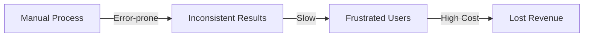
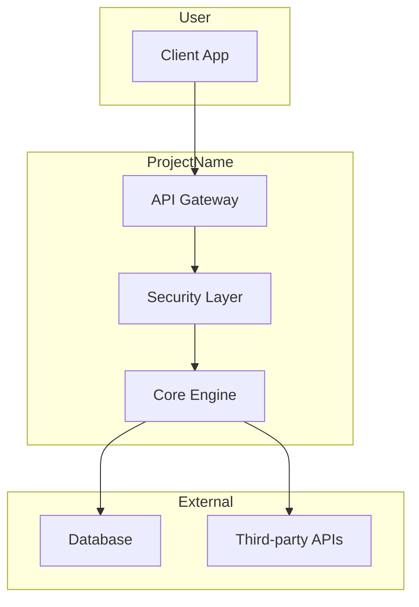
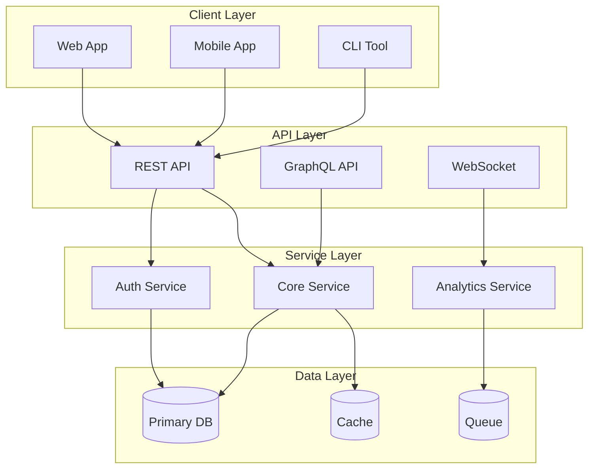
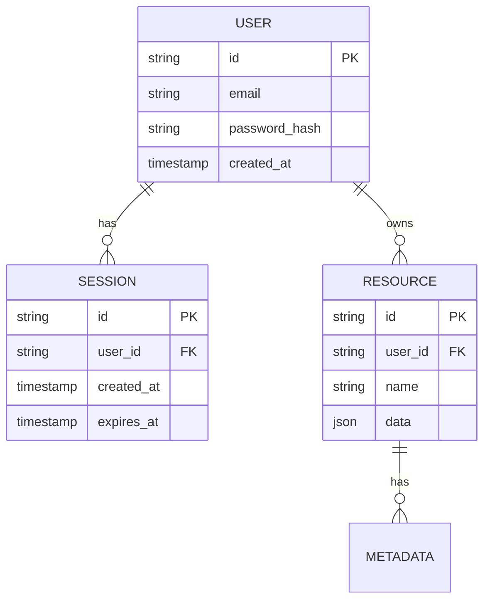
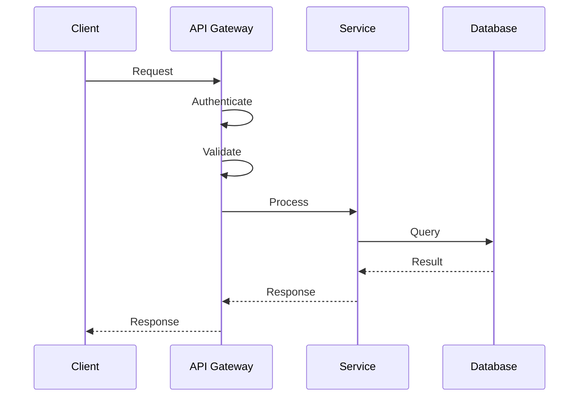
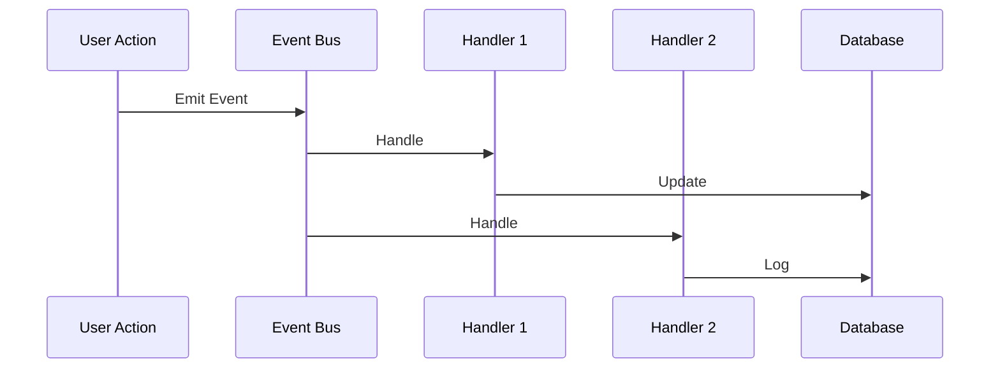
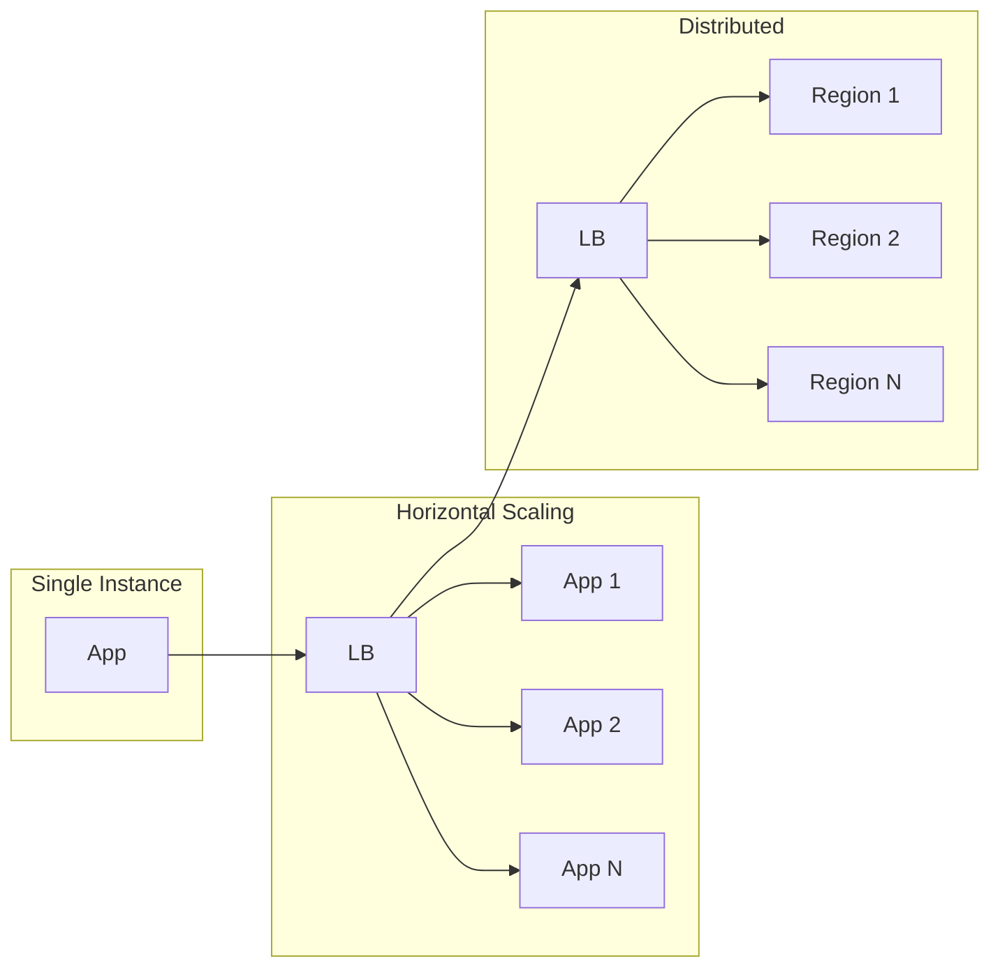
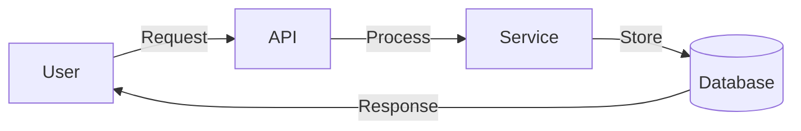
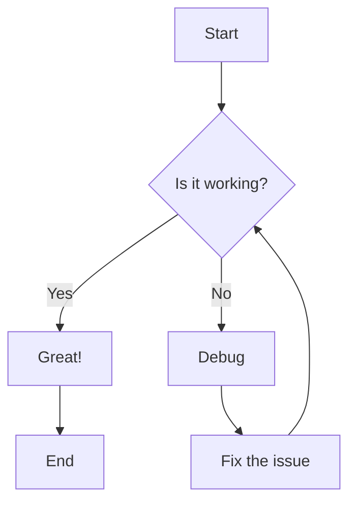

# Documentation Agent - MkDocs Material Theme

**Purpose**: Generate comprehensive, beautiful documentation using MkDocs with Material theme. Generalized for any project.

**Trigger**: Documentation setup, docs site creation, API reference generation

**Tools**: MkDocs, Material theme, Mermaid, typedoc (optional)

---

## 📁 1. Documentation Structure

Standard structure for professional documentation sites:

```
docs/
├── index.md                 # Landing page
├── what.md                  # What is this project?
├── why.md                   # Why use this project?
├── architecture.md          # System architecture
├── how.md                   # Developer guide
├── faq.md                   # Frequently asked questions
├── changelog.md             # Version history
├── contributing.md          # Contribution guidelines
├── quickstart/
│   ├── index.md            # Getting started overview
│   ├── installation.md     # Installation steps
│   ├── integration.md      # Integration guide
│   └── examples.md         # Code examples
├── guides/
│   ├── index.md            # Guides overview
│   ├── advanced-usage.md   # Advanced patterns
│   ├── best-practices.md   # Recommended patterns
│   └── troubleshooting.md  # Common issues
├── api/
│   ├── index.md            # API overview
│   ├── reference.md        # Generated API docs
│   └── examples.md         # API usage examples
├── stylesheets/
│   └── extra.css           # Custom styles
├── images/                  # Screenshots, diagrams
└── overrides/
    └── partials/
        └── header.html     # Custom header (optional)
```

### Directory Organization

```
project-root/
├── docs/                   # Documentation source
├── mkdocs.yml             # MkDocs configuration
├── site/                  # Generated site (gitignored)
└── README.md              # Links to docs
```

---

## ⚙️ 2. MkDocs Configuration

Complete `mkdocs.yml` example with all best practices:

```yaml
# mkdocs.yml

# Site Information
site_name: Project Name
site_description: Brief description of your project
site_author: Your Name or Organization
site_url: https://yourproject.dev

# Repository (for edit links)
repo_name: yourorg/yourproject
repo_url: https://github.com/yourorg/yourproject
edit_uri: edit/main/docs/

# Copyright
copyright: Copyright &copy; 2024 Your Organization

# Configuration
theme:
  name: material
  custom_dir: docs/overrides # Custom templates

  # Color scheme
  palette:
    # Light mode
    - media: "(prefers-color-scheme: light)"
      scheme: default
      primary: indigo
      accent: indigo
      toggle:
        icon: material/brightness-7
        name: Switch to dark mode
    # Dark mode
    - media: "(prefers-color-scheme: dark)"
      scheme: slate
      primary: indigo
      accent: indigo
      toggle:
        icon: material/brightness-4
        name: Switch to light mode

  # Features
  features:
    - navigation.instant # Instant loading (SPA)
    - navigation.tracking # Anchor tracking
    - navigation.tabs # Top-level tabs
    - navigation.tabs.sticky # Sticky tabs on scroll
    - navigation.sections # Section navigation
    - navigation.expand # Expand sidebar by default
    - navigation.indexes # Section index pages
    - navigation.top # Back to top button
    - search.highlight # Search term highlighting
    - search.share # Share search results
    - search.suggest # Search suggestions
    - toc.follow # Auto-follow TOC
    - content.code.copy # Copy code buttons
    - content.code.annotate # Code annotations
    - content.tabs.link # Link tab content

  # Typography
  font:
    text: Roboto
    code: Roboto Mono

  # Icons
  icon:
    logo: material/cube # Project logo
    repo: fontawesome/brands/github
    edit: material/file-edit-outline
    view: material/file-eye-outline

  # Favicon
  favicon: images/favicon.png

# Navigation
nav:
  - Home: index.md
  - Quickstart:
      - quickstart/index.md
      - Installation: quickstart/installation.md
      - Integration: quickstart/integration.md
      - Examples: quickstart/examples.md
  - Guides:
      - guides/index.md
      - Advanced Usage: guides/advanced-usage.md
      - Best Practices: guides/best-practices.md
      - Troubleshooting: guides/troubleshooting.md
  - Architecture: architecture.md
  - API Reference:
      - api/index.md
      - Reference: api/reference.md
      - Examples: api/examples.md
  - What & Why:
      - What is This?: what.md
      - Why Use This?: why.md
  - FAQ: faq.md
  - Changelog: changelog.md
  - Contributing: contributing.md

# Markdown Extensions
markdown_extensions:
  # Python Markdown
  - abbr # Abbreviations
  - admonition # Admonitions (!!!, ???)
  - attr_list # Attribute lists
  - def_list # Definition lists
  - footnotes # Footnotes
  - md_in_html # Markdown in HTML
  - toc:
      permalink: true # Permalink headers
      toc_depth: 3 # TOC depth

  # Python Markdown Extensions
  - pymdownx.arithmatex: # Math/LaTeX
      generic: true
  - pymdownx.betterem: # Better emphasis
      smart_enable: all
  - pymdownx.caret # Insert text (^)
  - pymdownx.details # Collapsible details
  - pymdownx.emoji: # Emoji support
      emoji_index: !!python/name:material.extensions.emoji.twemoji
      emoji_generator: !!python/name:material.extensions.emoji.to_svg
  - pymdownx.highlight: # Code highlighting
      anchor_linenums: true
      line_spans: __span
      pygments_lang_class: true
  - pymdownx.inlinehilite # Inline code highlighting
  - pymdownx.keys # Keyboard keys
  - pymdownx.mark # Mark text (==)
  - pymdownx.smartsymbols # Smart symbols
  - pymdownx.superfences: # Extended fences
      custom_fences:
        - name: mermaid
          class: mermaid
          format: !!python/name:pymdownx.superfences.fence_code_format
  - pymdownx.tabbed: # Tabbed content
      alternate_style: true
  - pymdownx.tasklist: # Task lists
      custom_checkbox: true
  - pymdownx.tilde # Delete text (~~)

# Plugins
plugins:
  - search: # Built-in search
      lang: en

  - git-revision-date-localized: # Last updated dates
      enable_creation_date: true
      type: datetime

  - minify: # HTML/CSS minification
      minify_html: true
      minify_js: true
      minify_css: true
      htmlmin_opts:
        remove_comments: true
      cache_safe: true

  - redirects: # Redirect old URLs
      redirect_maps:
        old-page.md: new-page.md
        v1/guide.md: ../guides/index.md

  - tags # Page tags
  - privacy # External link privacy

  # Versioned docs (if using mike)
  - mike:
      alias_type: symlink
      redirect_template: null
      canonical_version: null
      version_selector: true
      css_dir: css
      javascript_dir: js

# Extra CSS/JS
extra_css:
  - stylesheets/extra.css

extra_javascript:
  - javascripts/extra.js
  - https://polyfill.io/v3/polyfill.min.js?features=es6
  - https://cdn.jsdelivr.net/npm/mathjax@3/es5/tex-mml-chtml.js

# Extra Variables (for templates)
extra:
  social:
    - icon: fontawesome/brands/github
      link: https://github.com/yourorg/yourproject
    - icon: fontawesome/brands/discord
      link: https://discord.gg/yourinvite
    - icon: fontawesome/brands/twitter
      link: https://twitter.com/yourhandle

  # Version info (for mike)
  version:
    provider: mike

  # Analytics (optional)
  analytics:
    provider: google
    property: G-XXXXXXXXXX

  # Status indicators
  status:
    new: New
    deprecated: Deprecated
    experimental: Experimental
```

---

## 📝 3. Essential Page Templates

### 3.1 Index Page (`index.md`)

````markdown
---
title: Welcome to ProjectName
description: Brief, compelling description
---

# Welcome to ProjectName :material-rocket-launch:

<div class="grid cards" markdown>

- :material-clock-fast:{ .lg .middle } **Quick Start**

  ***

  Get up and running in 5 minutes with our step-by-step guide.

  [:octicons-arrow-right-24: Get Started](quickstart/index.md)

- :material-book-open-variant:{ .lg .middle } **Comprehensive Docs**

  ***

  Deep dive into architecture, APIs, and best practices.

  [:octicons-arrow-right-24: Read the Docs](architecture.md)

- :material-code-tags:{ .lg .middle } **API Reference**

  ***

  Complete API documentation with examples.

  [:octicons-arrow-right-24: View API](api/index.md)

- :material-help-circle:{ .lg .middle } **Get Help**

  ***

  FAQ, troubleshooting, and community support.

  [:octicons-arrow-right-24: Get Help](faq.md)

</div>

## Why Choose ProjectName?

!!! success "Key Benefits"

    - **Benefit 1**: Explanation of benefit
    - **Benefit 2**: Explanation of benefit
    - **Benefit 3**: Explanation of benefit

## Quick Example

```typescript
import { ProjectName } from "@yourorg/project-name";

// Initialize
const client = new ProjectName({
  apiKey: "your-api-key",
});

// Use it
const result = await client.doSomething();
console.log(result);
```
````

## Features

=== "Feature 1"

    Description of feature 1 with examples.

    ```typescript
    // Example code
    ```

=== "Feature 2"

    Description of feature 2 with examples.

    ```typescript
    // Example code
    ```

=== "Feature 3"

    Description of feature 3 with examples.

    ```typescript
    // Example code
    ```

## Next Steps

<div class="grid" markdown>

:octicons-sign-out-24: [Get Started](quickstart/index.md) – Start building now

:material-architectural-draft: [Architecture](architecture.md) – Understand the system

:material-chat-question: [FAQ](faq.md) – Common questions answered

</div>
```

### 3.2 What Page (`what.md`)

````markdown
---
title: What is ProjectName?
description: Understanding the problem and solution
---

# What is ProjectName?

## The Problem

!!! danger "Current Challenges"

    1. **Challenge 1**: Description and why it hurts
    2. **Challenge 2**: Description and why it hurts
    3. **Challenge 3**: Description and why it hurts

### Before ProjectName


````

## The Solution

!!! tip "ProjectName Approach"

    **One-sentence value proposition that captures the essence.**

### How It Works



### Key Features

| Feature   | Description  | Benefit        |
| --------- | ------------ | -------------- |
| Feature 1 | What it does | Why it matters |
| Feature 2 | What it does | Why it matters |
| Feature 3 | What it does | Why it matters |

## Technical Overview

!!! abstract "Architecture Principles"

    - **Principle 1**: Description
    - **Principle 2**: Description
    - **Principle 3**: Description

### Core Components

1. **Component A**: Brief description
2. **Component B**: Brief description
3. **Component C**: Brief description

## Next Steps

- [Why Use ProjectName?](why.md) – Benefits and use cases
- [Quickstart](quickstart/index.md) – Get started in 5 minutes
- [Architecture](architecture.md) – Deep dive into the system

````

### 3.3 Why Page (`why.md`)

```markdown
---
title: Why Use ProjectName?
description: Benefits, use cases, and competitive advantages
---

# Why Use ProjectName?

## Key Benefits

!!! success "Why developers choose ProjectName"

    ### :rocket: Performance

    **X% faster** than alternatives with benchmarks to prove it.

    - Metric 1
    - Metric 2
    - Metric 3

    ### :lock: Security

    **Enterprise-grade security** built into the core.

    - Security feature 1
    - Security feature 2
    - Security feature 3

    ### :zap: Developer Experience

    **Built by developers, for developers**.

    - DX feature 1
    - DX feature 2
    - DX feature 3

## Competitive Advantages

| Aspect | ProjectName | Alternative A | Alternative B |
|--------|-------------|---------------|---------------|
| Feature 1 | ✅ Yes | ❌ No | ⚠️ Partial |
| Feature 2 | ✅ Yes | ✅ Yes | ❌ No |
| Performance | 🚀 Fast | 🐢 Slow | 🚗 Medium |
| Cost | 💰 Affordable | 💸 Expensive | 💰 Affordable |

## Use Cases

!!! example "Perfect for"

    === "Use Case 1"

        **Title of Use Case**

        **Problem**: Description of the problem

        **Solution**: How ProjectName solves it

        ```typescript
        // Example implementation
        ```

    === "Use Case 2"

        **Title of Use Case**

        **Problem**: Description of the problem

        **Solution**: How ProjectName solves it

        ```typescript
        // Example implementation
        ```

    === "Use Case 3"

        **Title of Use Case**

        **Problem**: Description of the problem

        **Solution**: How ProjectName solves it

        ```typescript
        // Example implementation
        ```

## Success Stories

!!! quote "What developers say"

    > "ProjectName reduced our development time by 50% and improved our system reliability."
    >
    > — **Developer Name**, Company

## When to Use ProjectName

!!! tip "Best Fit"

    - ✅ **Scenario 1**: Description
    - ✅ **Scenario 2**: Description
    - ✅ **Scenario 3**: Description

!!! warning "Consider Alternatives"

    - ❌ **Scenario 1**: Why it might not fit
    - ❌ **Scenario 2**: Why it might not fit

## Next Steps

- [Get Started](quickstart/index.md) – Try it yourself
- [Architecture](architecture.md) – Understand the design
- [API Reference](api/index.md) – Explore the API
````

### 3.4 Architecture Page (`architecture.md`)

````markdown
---
title: Architecture
description: System design and components
---

# Architecture

## System Overview


````

## Core Components

### Component 1: Authentication

!!! abstract "Purpose"
Handles user authentication and authorization.

**Responsibilities:**

- Responsibility 1
- Responsibility 2
- Responsibility 3

**Key APIs:**

```typescript
interface AuthService {
  login(credentials: Credentials): Promise<Token>;
  logout(token: string): Promise<void>;
  validate(token: string): Promise<User>;
}
```

### Component 2: Core Engine

!!! abstract "Purpose"
Main business logic processing.

**Responsibilities:**

- Responsibility 1
- Responsibility 2
- Responsibility 3

### Component 3: Data Layer

!!! abstract "Purpose"
Data persistence and caching.

**Schema:**



## Data Flow

### Request Lifecycle



### Event Flow



## Security Architecture

!!! warning "Security Layers"

    ### Layer 1: Network

    - HTTPS/TLS
    - Rate limiting
    - IP whitelisting

    ### Layer 2: Application

    - Authentication
    - Authorization (RBAC)
    - Input validation

    ### Layer 3: Data

    - Encryption at rest
    - Encryption in transit
    - Audit logging

## Scaling Strategy



## Technology Stack

| Layer    | Technology       | Why                        |
| -------- | ---------------- | -------------------------- |
| Frontend | React/TypeScript | Component-based, type-safe |
| Backend  | Node.js/Fastify  | Fast, lightweight          |
| Database | PostgreSQL       | Relational, reliable       |
| Cache    | Redis            | Fast, in-memory            |
| Queue    | RabbitMQ         | Reliable messaging         |

## Design Principles

!!! tip "Core Principles"

    1. **Simplicity**: Keep it simple, avoid over-engineering
    2. **Modularity**: Loose coupling, high cohesion
    3. **Scalability**: Design for growth
    4. **Reliability**: Fault tolerance, graceful degradation
    5. **Security**: Defense in depth
    6. **Observability**: Logging, metrics, tracing

## Next Steps

- [API Reference](api/index.md) – Explore the APIs
- [Guides](guides/index.md) – Learn implementation patterns
- [Best Practices](guides/best-practices.md) – Recommended approaches

````

### 3.5 How/Developer Guide (`how.md` or `guides/advanced-usage.md`)

```markdown
---
title: Developer Guide
description: How to use ProjectName effectively
---

# Developer Guide

## Prerequisites

!!! requirement "Before You Start"

    - **Node.js**: v18+ (LTS recommended)
    - **Package Manager**: pnpm (recommended) or npm
    - **Environment**: Unix-like shell (macOS, Linux, WSL2)

## Installation

### Quick Install

```bash
# Using pnpm (recommended)
pnpm add @yourorg/project-name

# Using npm
npm install @yourorg/project-name

# Using yarn
yarn add @yourorg/project-name
````

### Verify Installation

```bash
# Check version
npx project-name --version

# Run health check
npx project-name doctor
```

## Configuration

### Basic Setup

Create a configuration file:

```typescript
// project-name.config.ts
import { defineConfig } from "@yourorg/project-name";

export default defineConfig({
  // Required
  apiKey: process.env.PROJECT_NAME_API_KEY,

  // Optional
  environment: "production",
  debug: false,

  // Advanced
  performance: {
    cache: true,
    timeout: 5000,
  },
});
```

### Environment Variables

```bash
# .env
PROJECT_NAME_API_KEY=your_api_key_here
PROJECT_NAME_ENV=production
PROJECT_NAME_DEBUG=false
```

## Basic Usage

### Initialize Client

```typescript
import { ProjectName } from "@yourorg/project-name";

// Simple initialization
const client = new ProjectName({
  apiKey: process.env.PROJECT_NAME_API_KEY,
});
```

### Common Operations

#### Operation 1: Example

```typescript
// Create a resource
const resource = await client.resources.create({
  name: "My Resource",
  type: "standard",
  config: {
    enabled: true,
  },
});

console.log(resource.id); // 'res_abc123'
```

#### Operation 2: Example

```typescript
// List resources
const resources = await client.resources.list({
  limit: 10,
  filter: {
    type: "standard",
  },
});

resources.forEach((r) => {
  console.log(r.name);
});
```

#### Operation 3: Example

```typescript
// Update a resource
const updated = await client.resources.update("res_abc123", {
  name: "Updated Name",
  config: {
    enabled: false,
  },
});
```

## Advanced Usage

### Error Handling

```typescript
import { ProjectNameError, ValidationError } from "@yourorg/project-name";

try {
  await client.resources.create(data);
} catch (error) {
  if (error instanceof ValidationError) {
    console.error("Validation failed:", error.details);
  } else if (error instanceof ProjectNameError) {
    console.error("API error:", error.message);
  } else {
    throw error;
  }
}
```

### Retry Logic

```typescript
import { withRetry } from "@yourorg/project-name";

const result = await withRetry(() => client.resources.create(data), {
  maxRetries: 3,
  backoff: "exponential",
  initialDelay: 1000,
});
```

### Pagination

```typescript
// Automatic pagination
for await (const resource of client.resources.listAll()) {
  console.log(resource.id);
}

// Manual pagination
let cursor: string | undefined;
do {
  const page = await client.resources.list({
    limit: 50,
    cursor,
  });

  page.items.forEach((r) => console.log(r.id));
  cursor = page.nextCursor;
} while (cursor);
```

### Webhooks

```typescript
// Express example
import express from "express";
import { WebhookHandler } from "@yourorg/project-name";

const app = express();
const webhook = new WebhookHandler(process.env.WEBHOOK_SECRET);

app.post("/webhooks", express.raw({ type: "application/json" }), (req, res) => {
  const event = webhook.verify(req.body, req.headers);

  switch (event.type) {
    case "resource.created":
      console.log("Resource created:", event.data);
      break;
    case "resource.updated":
      console.log("Resource updated:", event.data);
      break;
  }

  res.json({ received: true });
});
```

## Best Practices

!!! tip "Do This"

    - ✅ Use environment variables for secrets
    - ✅ Implement retry logic for transient failures
    - ✅ Handle pagination for large datasets
    - ✅ Log errors with context

!!! danger "Avoid This"

    - ❌ Hardcode API keys in source code
    - ❌ Ignore error handling
    - ❌ Fetch all data without pagination
    - ❌ Block the event loop with sync operations

## Performance Optimization

### Caching

```typescript
const client = new ProjectName({
  apiKey: process.env.PROJECT_NAME_API_KEY,
  cache: {
    enabled: true,
    ttl: 3600, // 1 hour
    strategy: "stale-while-revalidate",
  },
});
```

### Batch Operations

```typescript
// Batch create
const resources = await client.resources.createBatch([
  { name: "Resource 1" },
  { name: "Resource 2" },
  { name: "Resource 3" },
]);
```

## Troubleshooting

### Common Issues

!!! failure "Authentication Error"

    **Error**: `AuthenticationError: Invalid API key`

    **Solution**:

    1. Verify your API key is correct
    2. Check if the key has expired
    3. Ensure environment variable is set

!!! failure "Rate Limit Exceeded"

    **Error**: `RateLimitError: Too many requests`

    **Solution**:

    1. Implement exponential backoff
    2. Reduce request frequency
    3. Contact support for higher limits

## Next Steps

- [API Reference](api/index.md) – Full API documentation
- [Examples](quickstart/examples.md) – More code examples
- [Best Practices](guides/best-practices.md) – Production tips

````

### 3.6 FAQ Page (`faq.md`)

```markdown
---
title: Frequently Asked Questions
description: Common questions and answers
---

# Frequently Asked Questions

## General

### What is ProjectName?

???+ answer
    ProjectName is a brief description of what the project does and its main purpose.

### Who should use ProjectName?

???+ answer
    ProjectName is ideal for:

    - **Developers**: Who need to [specific need]
    - **Teams**: Who want to [specific benefit]
    - **Organizations**: Looking for [specific solution]

### Is ProjectName free?

???+ answer
    Yes! ProjectName offers:

    - **Free tier**: Description of free tier
    - **Pro tier**: Description of paid tier
    - **Enterprise**: Description of enterprise tier

    See our [pricing page](https://example.com/pricing) for details.

## Getting Started

### How do I install ProjectName?

???+ answer
    ```bash
    pnpm add @yourorg/project-name
    ```

    See the [Installation Guide](quickstart/installation.md) for detailed instructions.

### What are the prerequisites?

???+ answer
    - Node.js v18+
    - pnpm or npm
    - API key (get one at [dashboard.example.com](https://dashboard.example.com))

### How do I get an API key?

???+ answer
    1. Sign up at [dashboard.example.com](https://dashboard.example.com)
    2. Navigate to API Keys
    3. Click "Create New Key"
    4. Copy and store securely

## Usage

### How do I handle errors?

???+ answer
    ```typescript
    try {
      await client.doSomething();
    } catch (error) {
      if (error instanceof ProjectNameError) {
        console.error('Error:', error.message);
        console.error('Code:', error.code);
      }
    }
    ```

    See [Error Handling Guide](guides/advanced-usage.md#error-handling) for more details.

### How do I implement pagination?

???+ answer
    ```typescript
    // Automatic pagination
    for await (const item of client.items.listAll()) {
      console.log(item);
    }
    ```

    See [Pagination Guide](guides/advanced-usage.md#pagination) for more options.

### Can I use ProjectName in the browser?

???+ answer
    Yes! ProjectName works in:

    - ✅ Node.js
    - ✅ Modern browsers
    - ✅ Edge runtimes
    - ✅ Serverless functions

## Technical

### What technologies does ProjectName use?

???+ answer
    - **Language**: TypeScript
    - **Runtime**: Node.js, browsers
    - **HTTP Client**: Fetch API
    - **Testing**: Jest, Vitest

### Is ProjectName secure?

???+ answer
    Yes! Security features include:

    - ✅ HTTPS/TLS encryption
    - ✅ API key authentication
    - ✅ Request signing
    - ✅ Rate limiting
    - ✅ Audit logging

### What are the rate limits?

???+ answer
    | Tier | Rate Limit |
    |------|-----------|
    | Free | 100 req/min |
    | Pro | 1,000 req/min |
    | Enterprise | Unlimited |

    Rate limit headers are included in all responses.

## Troubleshooting

### I'm getting authentication errors. What should I do?

???+ answer
    1. Verify your API key is correct
    2. Check if the key has been revoked
    3. Ensure you're using the correct environment
    4. Contact support if issues persist

### The SDK is slow. How can I improve performance?

???+ answer
    1. Enable caching:

    ```typescript
    const client = new ProjectName({
      apiKey: process.env.API_KEY,
      cache: { enabled: true },
    });
    ```

    2. Use batch operations
    3. Implement pagination
    4. Check your network connection

### How do I debug issues?

???+ answer
    Enable debug mode:

    ```typescript
    const client = new ProjectName({
      apiKey: process.env.API_KEY,
      debug: true,
    });
    ```

    This will log all requests and responses.

## Support

### How do I get help?

???+ answer
    - 📖 [Documentation](index.md)
    - 💬 [Discord Community](https://discord.gg/example)
    - 🐛 [GitHub Issues](https://github.com/yourorg/project-name/issues)
    - 📧 [Email Support](mailto:support@example.com)

### How do I report a bug?

???+ answer
    1. Check [existing issues](https://github.com/yourorg/project-name/issues)
    2. Create a [new issue](https://github.com/yourorg/project-name/issues/new)
    3. Include:
       - Description of the bug
       - Steps to reproduce
       - Expected vs actual behavior
       - Environment details

### How do I request a feature?

???+ answer
    We love feedback! Please:

    1. Check our [roadmap](https://github.com/yourorg/project-name/projects)
    2. Open a [feature request](https://github.com/yourorg/project-name/issues/new?template=feature_request.md)
    3. Describe the use case and benefit

## Still Have Questions?

Can't find what you're looking for?

[Contact Support](mailto:support@example.com){ .md-button .md-button--primary }
[Join Discord](https://discord.gg/example){ .md-button }
````

---

## 🎨 4. Writing Guidelines

### 4.1 Clear and Concise

!!! tip "Write for Scanners"

    - **Use headers** to break up content
    - **Keep paragraphs short** (3-4 sentences max)
    - **Lead with conclusions**, then explain
    - **Use lists** for multiple items
    - **Bold key terms** for skimming

**Bad Example:**

```
In order to get started with ProjectName, you will first need to install the package using your preferred package manager and then you can begin by configuring it with your API key which you can obtain from the dashboard.
```

**Good Example:**

```
## Quick Start

1. Install: `pnpm add project-name`
2. Configure: Set `API_KEY` environment variable
3. Use: See example below
```

### 4.2 Code Examples

!!! tip "Show, Don't Just Tell"

**Bad:**

```
You can create a resource using the create method with your configuration.
```

**Good:**

````
Create a resource with the `create` method:

```typescript
const resource = await client.resources.create({
  name: 'My Resource',
  type: 'standard',
});
````

````

### Code Example Guidelines

- **Always include imports**: Show where things come from
- **Use real examples**: Not `foo`, `bar`, placeholder data
- **Show complete snippets**: Runnable code, not fragments
- **Highlight important lines**: Use `hl_lines` or comments
- **Add context**: Explain what the code does

```typescript
// Import the client (1)
import { ProjectName } from '@yourorg/project-name';

// Initialize with your API key
const client = new ProjectName({
  apiKey: process.env.API_KEY, // (2)
});

// Create a resource (3)
const resource = await client.resources.create({
  name: 'Production Database',
  type: 'postgres',
  config: {
    version: '15',
    storage: '100GB',
  },
});

console.log(resource.id); // 'res_xyz123'
````

1. Import statement for TypeScript/Node.js
2. Never hardcode API keys - use environment variables
3. Real example with actual configuration

### 4.3 Visual Aids

#### Use Diagrams



#### Use Tables

| Feature  | Basic  | Pro          | Enterprise |
| -------- | ------ | ------------ | ---------- |
| Requests | 1K/day | 10K/day      | Unlimited  |
| Storage  | 1GB    | 10GB         | Unlimited  |
| Support  | Email  | Email + Chat | Dedicated  |

#### Use Admonitions

!!! note "Context or side note"
Additional information that doesn't fit the main flow.

!!! warning "Important consideration"
Something users should be aware of.

!!! danger "Critical information"
Something that could cause issues if ignored.

### 4.4 Progressive Disclosure

Start simple, add complexity:

**Level 1: Quick Start**

```typescript
const client = new ProjectName({ apiKey: process.env.API_KEY });
const result = await client.doSomething();
```

**Level 2: Common Options**

```typescript
const client = new ProjectName({
  apiKey: process.env.API_KEY,
  environment: "production",
  timeout: 5000,
});
```

**Level 3: Advanced Configuration**

```typescript
const client = new ProjectName({
  apiKey: process.env.API_KEY,
  environment: "production",
  timeout: 5000,
  retry: {
    maxAttempts: 3,
    backoff: "exponential",
  },
  cache: {
    enabled: true,
    ttl: 3600,
  },
});
```

### 4.5 Audience Awareness

Write for **developers**, but consider different experience levels:

!!! tip "For Beginners" - Explain concepts, not just code - Provide step-by-step instructions - Link to prerequisite topics

!!! tip "For Experts" - Get to the point quickly - Show advanced patterns - Assume knowledge of basics

**Example Structure:**

```
## Quick Start
[Simple 5-minute setup for beginners]

## Deep Dive
[Detailed explanation for those who want to understand]

## Advanced Usage
[Complex patterns and edge cases]

## API Reference
[Comprehensive documentation]
```

---

## 🎨 5. Material Theme Features

### 5.1 Navigation

#### Tabs (Top-Level)

```yaml
# mkdocs.yml
theme:
  features:
    - navigation.tabs
    - navigation.tabs.sticky
```

#### Sections (Sidebar)

```yaml
nav:
  - Guides:
      - guides/index.md
      - Getting Started: guides/getting-started.md
      - Advanced: guides/advanced.md
```

#### Anchors (Page TOC)

```yaml
markdown_extensions:
  - toc:
      permalink: true
      toc_depth: 3
```

### 5.2 Search

```yaml
theme:
  features:
    - search.highlight
    - search.share
    - search.suggest

plugins:
  - search:
      lang: en
      separator: '[\s\-\.]+'
```

### 5.3 Code Features

#### Copy Button

```yaml
theme:
  features:
    - content.code.copy
```

#### Line Numbers

````markdown
```typescript linenums="1"
const x = 1;
const y = 2;
const z = x + y;
```
````

````

#### Line Highlighting

```markdown
```typescript hl_lines="2 3"
const x = 1;
const y = 2;  // Highlighted
const z = x + y;  // Highlighted
````

````

#### Inline Highlighting

```markdown
The `:::typescript constructor()` method initializes the client.
````

### 5.4 Admonitions

#### Basic Syntax

```markdown
!!! note "Optional Title"
Content here.

??? note "Collapsed by Default"
Content revealed on click.

???+ note "Open by Default"
Content visible, can collapse.
```

#### Types

| Type       | Purpose             |
| ---------- | ------------------- |
| `note`     | General information |
| `abstract` | Summary or overview |
| `info`     | Helpful information |
| `tip`      | Helpful suggestion  |
| `success`  | Positive outcome    |
| `question` | FAQ-style question  |
| `warning`  | Important warning   |
| `failure`  | Negative outcome    |
| `danger`   | Critical warning    |
| `bug`      | Known issue         |
| `example`  | Code example        |
| `quote`    | Blockquote          |

```markdown
!!! note "Note"
Default styling.

!!! abstract "Abstract"
Summary information.

!!! info "Info"
Additional context.

!!! tip "Pro Tip"
Expert advice.

!!! success "Success"
Positive outcome.

!!! question "FAQ"
Common question.

!!! warning "Warning"
Be careful!

!!! failure "Error"
Something went wrong.

!!! danger "Danger"
Critical warning!

!!! bug "Known Issue"
Bug description.

!!! example "Example"
Code or usage example.

!!! quote "Quote"
Inspirational or citation.
```

### 5.5 Tabs

````markdown
=== "TypeScript"

    ```typescript
    const client = new Client();
    ```

=== "JavaScript"

    ```javascript
    const client = new Client();
    ```

=== "Python"

    ```python
    client = Client()
    ```
````

### 5.6 Grid Cards

```markdown
<div class="grid cards" markdown>

- :material-rocket-launch:{ .lg .middle } **Feature 1**

  ***

  Description of feature 1

- :material-lightning-bolt:{ .lg .middle } **Feature 2**

  ***

  Description of feature 2

</div>
```

---

## 📊 6. Markdown Extensions

### 6.1 Admonitions

Already covered in section 5.4.

### 6.2 Code Highlighting

#### Language Support

````markdown
```typescript
const x: number = 1;
```
````

```python
x = 1
```

```rust
let x = 1;
```

```bash
pnpm install
```

````

#### Line Numbers

```markdown
```typescript linenums="1"
// Line 1
// Line 2
// Line 3
````

````

#### Highlighting Lines

```markdown
```typescript hl_lines="2-3"
const x = 1;
const y = 2;  // Highlighted
const z = x + y;  // Highlighted
````

````

### 6.3 Tabbed Content

```markdown
=== "Tab 1"
    Content for tab 1.

=== "Tab 2"
    Content for tab 2.

=== "Tab 3"
    Content for tab 3.
````

### 6.4 Tables

```markdown
| Column 1 | Column 2 | Column 3 |
| -------- | -------- | -------- |
| Row 1    | Data     | Data     |
| Row 2    | Data     | Data     |
| Row 3    | Data     | Data     |
```

#### Aligned Columns

```markdown
| Left | Center | Right |
| :--- | :----: | ----: |
| L    |   C    |     R |
```

### 6.5 Task Lists

```markdown
- [x] Task 1 (completed)
- [x] Task 2 (completed)
- [ ] Task 3 (pending)
- [ ] Task 4 (pending)
```

### 6.6 Footnotes

```markdown
Here's a statement[^1] with a footnote.

[^1]: This is the footnote content.
```

### 6.7 Abbreviations

```markdown
_[API]: Application Programming Interface
_[SDK]: Software Development Kit

The API and SDK work together.
```

### 6.8 Definition Lists

```markdown
`Term 1`
: Definition of term 1

`Term 2`
: Definition of term 2
with multiple lines
```

---

## 🔄 7. Mermaid Diagram Examples

### 7.1 Flowchart

````markdown

````

````

### 7.2 Sequence Diagram

```markdown
```mermaid
sequenceDiagram
    participant U as User
    participant A as API
    participant D as Database

    U->>A: POST /resource
    A->>A: Validate
    A->>D: Insert
    D-->>A: Success
    A-->>U: 201 Created
````

````

### 7.3 Class Diagram

```markdown
```mermaid
classDiagram
    class User {
        +string id
        +string email
        +string name
        +login()
        +logout()
    }

    class Session {
        +string id
        +string userId
        +timestamp expiresAt
        +isValid()
    }

    User "1" --> "*" Session : has
````

````

### 7.4 State Diagram

```markdown
```mermaid
stateDiagram-v2
    [*] --> Pending
    Pending --> Processing: Start
    Processing --> Success: Complete
    Processing --> Failed: Error
    Success --> [*]
    Failed --> [*]
````

````

### 7.5 Entity Relationship Diagram

```markdown
```mermaid
erDiagram
    USER ||--o{ ORDER : places
    USER {
        string id PK
        string email
        string name
    }
    ORDER ||--|{ LINE_ITEM : contains
    ORDER {
        string id PK
        string userId FK
        date created
        string status
    }
    LINE_ITEM {
        string id PK
        string orderId FK
        string productId FK
        int quantity
    }
````

````

### 7.6 Gantt Chart

```markdown
```mermaid
gantt
    title Project Timeline
    dateFormat YYYY-MM-DD

    section Planning
    Research     :a1, 2024-01-01, 7d
    Design       :a2, after a1, 5d

    section Development
    Frontend     :b1, after a2, 10d
    Backend      :b2, after a2, 10d
    Testing      :b3, after b1, 5d

    section Deployment
    Staging      :c1, after b3, 2d
    Production   :c2, after c1, 1d
````

````

### 7.7 Pie Chart

```markdown
```mermaid
pie title Market Share
    "Product A" : 40
    "Product B" : 30
    "Product C" : 20
    "Other" : 10
````

````

### 7.8 Git Graph

```markdown
```mermaid
gitGraph
    commit
    commit
    branch develop
    checkout develop
    commit
    commit
    checkout main
    merge develop
    commit
````

````

---

## 🚀 8. Versioning & Deployment

### 8.1 GitHub Pages

#### Setup

```bash
# Install dependencies
pip install mkdocs-material
pip install mike  # For versioning

# Build and deploy
mkdocs build
mkdocs gh-deploy
````

#### GitHub Actions

```yaml
# .github/workflows/docs.yml
name: Documentation

on:
  push:
    branches:
      - main
    paths:
      - "docs/**"
      - "mkdocs.yml"

permissions:
  contents: write

jobs:
  deploy:
    runs-on: ubuntu-latest
    steps:
      - uses: actions/checkout@v4
        with:
          fetch-depth: 0 # For git-revision-date plugin

      - name: Setup Python
        uses: actions/setup-python@v5
        with:
          python-version: "3.x"

      - name: Install dependencies
        run: |
          pip install mkdocs-material
          pip install mike
          pip install mkdocs-git-revision-date-localized-plugin
          pip install mkdocs-minify-plugin

      - name: Deploy Documentation
        run: |
          git config user.name github-actions
          git config user.email github-actions@github.com
          mike deploy --push --update-aliases 1.0 latest
```

### 8.2 Versioned Docs (mike)

#### Configuration

```yaml
# mkdocs.yml
plugins:
  - mike:
      alias_type: symlink
      redirect_template: null
      canonical_version: null
      version_selector: true
      css_dir: css
      javascript_dir: js

extra:
  version:
    provider: mike
```

#### Deploy Commands

```bash
# Deploy specific version
mike deploy 1.0

# Deploy and set alias
mike deploy 1.0 latest --update-aliases

# Set default version
mike set-default latest

# Push to GitHub Pages
mike deploy --push 1.0 latest
```

#### Version Selector

```html
<!-- docs/overrides/partials/header.html -->
  

<div class="md-header__version">
  <select id="version-select">
    <option value="latest">Latest</option>
    <option value="1.0">v1.0</option>
    <option value="0.9">v0.9</option>
  </select>
</div>

```

### 8.3 Custom Domain

#### DNS Configuration

```
# A Records (Apex domain)
yourdomain.dev → GitHub Pages IPs

# CNAME (Subdomain)
docs.yourdomain.dev → yourorg.github.io
```

#### MkDocs Configuration

```yaml
# mkdocs.yml
site_url: https://docs.yourdomain.dev

# CNAME file (in docs/)
echo "docs.yourdomain.dev" > docs/CNAME
```

### 8.4 CI/CD Integration

#### Full Pipeline Example

```yaml
# .github/workflows/docs.yml
name: Documentation

on:
  push:
    branches: [main]
    paths: ["docs/**", "mkdocs.yml"]
  pull_request:
    branches: [main]
    paths: ["docs/**", "mkdocs.yml"]

permissions:
  contents: write
  pull-requests: write

jobs:
  # Build check for PRs
  build:
    if: github.event_name == 'pull_request'
    runs-on: ubuntu-latest
    steps:
      - uses: actions/checkout@v4
      - uses: actions/setup-python@v5
        with:
          python-version: "3.x"
      - run: pip install mkdocs-material
      - run: mkdocs build --strict
      - uses: actions/upload-artifact@v4
        with:
          name: site
          path: site/

  # Deploy on main branch
  deploy:
    if: github.event_name == 'push'
    runs-on: ubuntu-latest
    steps:
      - uses: actions/checkout@v4
        with:
          fetch-depth: 0

      - uses: actions/setup-python@v5
        with:
          python-version: "3.x"

      - name: Install dependencies
        run: |
          pip install mkdocs-material
          pip install mike
          pip install mkdocs-git-revision-date-localized-plugin
          pip install mkdocs-minify-plugin

      - name: Get version
        id: version
        run: |
          VERSION=$(node -p "require('./package.json').version")
          echo "version=$VERSION" >> $GITHUB_OUTPUT

      - name: Deploy documentation
        run: |
          git config user.name github-actions
          git config user.email github-actions@github.com
          mike deploy --push --update-aliases ${{ steps.version.outputs.version }} latest

      - name: Comment PR
        if: github.event_name == 'pull_request'
        uses: actions/github-script@v7
        with:
          script: |
            github.rest.issues.createComment({
              issue_number: context.issue.number,
              owner: context.repo.owner,
              repo: context.repo.repo,
              body: '📚 Documentation preview: ${{ steps.deploy.outputs.url }}'
            })
```

---

## ✨ 9. Best Practices

### 9.1 Keep Docs Close to Code

```
src/
  components/
    Button.tsx
    Button.test.tsx
    Button.md         # Component-specific docs
docs/
  components/
    Button.md         # Extended documentation
```

### 9.2 Update Docs with Features

!!! tip "Documentation-Driven Development"

    1. **Write docs first** - Describe the feature
    2. **Implement** - Build according to docs
    3. **Update docs** - Reflect actual implementation

### 9.3 Link to Source Code

```markdown
See the implementation in [`src/client.ts`](https://github.com/org/repo/blob/main/src/client.ts).
```

### 9.4 Include Troubleshooting

Every major feature should have:

- Common errors
- Solutions
- Debug tips
- Support resources

### 9.5 Add Contribution Guidelines

```markdown
# Contributing

## Quick Start

1. Fork the repository
2. Create a feature branch
3. Make changes
4. Update documentation
5. Submit PR

## Documentation Guidelines

- Keep it simple
- Update with code changes
- Use examples
- Test all code snippets
```

### 9.6 Accessibility

!!! tip "Make Docs Accessible"

    - Use semantic HTML
    - Add alt text to images
    - Ensure color contrast
    - Support keyboard navigation
    - Test with screen readers

---

## 🎯 10. Advanced Features

### 10.1 API Reference Generation

#### Using TypeDoc

```bash
# Install
pnpm add -D typedoc typedoc-plugin-markdown

# Generate
typedoc --plugin typedoc-plugin-markdown --out docs/api src/index.ts
```

#### Configuration

```json
// typedoc.json
{
  "entryPoints": ["src/index.ts"],
  "out": "docs/api",
  "plugin": ["typedoc-plugin-markdown"],
  "readme": "none",
  "hideBreadcrumbs": true,
  "hideInPageTOC": true
}
```

### 10.2 Changelog Integration

```yaml
# mkdocs.yml
nav:
  - Changelog: changelog.md

# Use git-changelog plugin
plugins:
  - git-changelog:
      repository: yourorg/yourproject
```

### 10.3 Blog Section

```yaml
# mkdocs.yml
plugins:
  - blog:
      blog_dir: blog
      post_dir: "{blog}/posts"
      post_date_format: yyyy-MM-dd
      post_url_format: "{date}/{slug}"

nav:
  - Blog: blog/index.md
```

### 10.4 Analytics Integration

```yaml
# mkdocs.yml
extra:
  analytics:
    provider: google
    property: G-XXXXXXXXXX
    feedback:
      title: Was this page helpful?
      ratings:
        - icon: material/thumb-up-outline
          name: Positive
          data: 1
          note: Thanks for your feedback!
        - icon: material/thumb-down-outline
          name: Negative
          data: 0
          note: Thanks for your feedback! We'll improve this.
```

### 10.5 Custom Styles

```css
/* docs/stylesheets/extra.css */

/* Custom colors */
:root {
  --md-primary-fg-color: #3f51b5;
  --md-accent-fg-color: #ff4081;
}

/* Custom admonitions */
.md-typeset .admonition.example,
.md-typeset details.example {
  border-color: rgb(124, 77, 255);
}

.md-typeset .example > .admonition-title,
.md-typeset .example > summary {
  background-color: rgba(124, 77, 255, 0.1);
}

/* Custom code blocks */
.highlight {
  margin: 1em 0;
}

/* Custom grid cards */
.grid.cards > ul > li {
  border: 1px solid var(--md-default-fg-color--lightest);
  border-radius: 0.5rem;
  padding: 1rem;
  transition: all 0.2s;
}

.grid.cards > ul > li:hover {
  border-color: var(--md-primary-fg-color);
  box-shadow: 0 4px 6px rgba(0, 0, 0, 0.1);
}
```

### 10.6 Custom JavaScript

```javascript
// docs/javascripts/extra.js

// Version selector
document.addEventListener("DOMContentLoaded", function () {
  const versionSelect = document.getElementById("version-select");
  if (versionSelect) {
    versionSelect.addEventListener("change", function () {
      window.location.href = this.value;
    });
  }
});

// Copy code feedback
document.addEventListener("DOMContentLoaded", function () {
  document.querySelectorAll(".md-clipboard").forEach((button) => {
    button.addEventListener("click", function () {
      const originalText = this.textContent;
      this.textContent = "Copied!";
      setTimeout(() => {
        this.textContent = originalText;
      }, 2000);
    });
  });
});
```

---

## 📦 11. Setup Checklist

### Initial Setup

```bash
# Create docs directory
mkdir -p docs/{quickstart,guides,api,stylesheets,images}

# Create mkdocs.yml
touch mkdocs.yml

# Install dependencies
pip install mkdocs-material
pip install mkdocs-git-revision-date-localized-plugin
pip install mkdocs-minify-plugin
pip install mike  # For versioning

# Initialize git (if not already)
git init

# Add to .gitignore
echo "site/" >> .gitignore
```

### Development

```bash
# Local development
mkdocs serve

# Build for production
mkdocs build

# Deploy to GitHub Pages
mkdocs gh-deploy
```

### Quality Checks

```bash
# Strict build (warnings = errors)
mkdocs build --strict

# Check links
pip install mkdocs-linkcheck
mkdocs build && mkdocs linkcheck

# Validate HTML
pip install html5validator
html5validator --root site/
```

---

## 🎨 12. Quick Reference

### Common Commands

| Command                    | Purpose                |
| -------------------------- | ---------------------- |
| `mkdocs serve`             | Local dev server       |
| `mkdocs build`             | Build site             |
| `mkdocs gh-deploy`         | Deploy to GitHub Pages |
| `mike deploy VERSION`      | Deploy versioned docs  |
| `mike set-default VERSION` | Set default version    |

### Admonition Types

| Type      | Icon | Purpose      |
| --------- | ---- | ------------ |
| `note`    | ℹ️   | General info |
| `tip`     | 💡   | Pro tips     |
| `warning` | ⚠️   | Warnings     |
| `danger`  | 🚨   | Critical     |
| `success` | ✅   | Positive     |
| `failure` | ❌   | Errors       |
| `bug`     | 🐛   | Known issues |
| `example` | 📝   | Examples     |

### Mermaid Diagrams

| Type              | Use Case        |
| ----------------- | --------------- |
| `graph`           | Flowcharts      |
| `sequenceDiagram` | Interactions    |
| `classDiagram`    | Data structures |
| `erDiagram`       | Databases       |
| `gantt`           | Timelines       |
| `pie`             | Proportions     |

---

## 📚 13. Resources

- [Material for MkDocs](https://squidfunk.github.io/mkdocs-material/)
- [MkDocs Documentation](https://www.mkdocs.org/)
- [Mermaid Documentation](https://mermaid.js.org/)
- [Mike Documentation](https://github.com/jimporter/mike)
- [TypeDoc](https://typedoc.org/)
- [GitHub Pages](https://pages.github.com/)

---

## ✅ Completion Checklist

Before deploying:

- [ ] All pages have descriptions
- [ ] Navigation is logical
- [ ] Code examples are tested
- [ ] Links are valid
- [ ] Images have alt text
- [ ] Admonitions used appropriately
- [ ] Diagrams render correctly
- [ ] Search works
- [ ] Mobile responsive
- [ ] Performance optimized
- [ ] Analytics configured
- [ ] Version selector works
- [ ] Custom domain configured
- [ ] CI/CD pipeline working

---

**Ship it! 🚀**

_Generated by Documentation Agent - MkDocs Material Theme_
